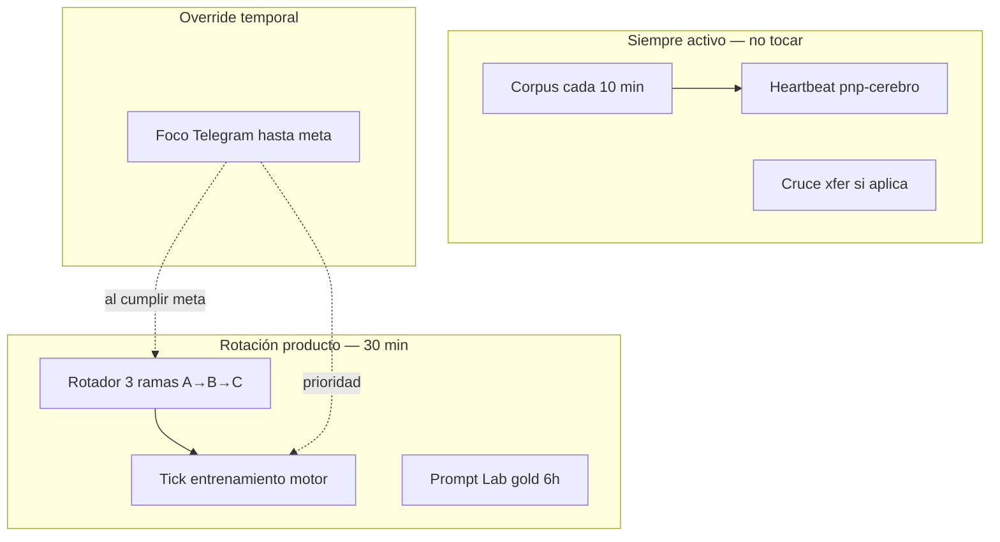

# NP Auditor — Producto MCP / Skill · Ramas · Rotación · Telegram

> **Copia canónica para GitHub.** Índice: [INDEX.md](INDEX.md) · Mapa monorepo: [`../../README.md`](../../README.md)

**Documento maestro** del producto público (MCP + Skill Cursor) y su acoplamiento al organismo NP Brain.  
**Versión:** 0.2 · **Fecha:** 2026-06-23  
**Audiencia:** equipo, beta testers, implementación OpenClaw/Telegram

---

## 1. Qué es el producto (una frase)

> **NP Auditor** audita prompts y respuestas de agentes de IA de forma **medible y auditable** — antes de quemar tokens, antes de mover plata, antes de romper prod.

No es un chatbot ni un “optimizador de prompts a ojo”. Es un **examinador** con sensores reales.

---

## 2. MCP + Skill — qué hace exactamente

### 2.1 Para el usuario (B2C / Cursor)

| Tool MCP | Qué hace | ¿Usa LLM? | Tiempo |
|----------|----------|-----------|--------|
| `np_audit_input` | Revisa estructura del prompt (objetivo, criterio, riesgo de loop) | No | ~1 s |
| `np_verify_response` | Verifica claims; score de alucinación en lo medible | No | ~1 s |
| `np_agent_risks` | Checklist de riesgos (pagos / prod / general) | No | ~1 s |

**Skill Cursor (`np-auditor`):** enseña al agente cuándo llamar esas tools (antes de prompts caros, tras respuestas con claims, en contexto wallet/prod).

### 2.2 Qué recibe el cliente (GitHub público)

- Paquete MCP (este repo — raíz `np-auditor/`)
- Skill instalable
- Manifests de dimensiones **verificables** (subset, sin código del motor)
- Schemas JSON (Claim, Fixture, Informe)

### 2.3 Qué NO sale del servidor privado

- Motor IA10Vatios, sensores, explorador
- Entrenamiento EUREKA
- Bancos completos `banco_*.json`

### 2.4 Propuesta de valor (copy)

- **Antes:** “Confía en la IA.”
- **Con NP Auditor:** “Estas son las formas medibles en que puede fallar — y qué tan claro está tu input.”

---

## 3. Tres ramas prioritarias del producto

Estas ramas son el **foco comercial**. El organismo Harvard sigue vivo en segundo plano; el **entrenamiento automático** prioriza estas tres en rotación.

### Rama A — `agent-risk` (Pagos agenticos · B2B)

**Cliente tipo:** Santi, fintech, wallets, agentes que mueven dinero.

**Problema:** pagar de más, duplicados, wallet vaciada, acción no autorizada.

**Dims objetivo (nuevas, medidas):**

| ID orientativo | Qué mide |
|----------------|----------|
| `agent_pay_cap_v1` | Pago > techo configurado |
| `agent_payee_whitelist_v1` | Beneficiario no autorizado |
| `agent_human_gate_v1` | Sin aprobación humana |
| `agent_idempotency_v1` | Doble débito / replay |
| `agent_velocity_v1` | Micro-pagos acumulados |
| `psych1_loss_aversion_v1` | (puente) sesgo decisión — ya en banco |

**Meta MVP producto:** **≥ 10 dims** `agent-risk/*` verificadas + informe piloto.

**Fixtures Prompt Lab:** escenarios pago sin límite, sin whitelist, prompt injection en wallet.

**MCP:** `np_agent_risks` con `domain=payment`.

---

### Rama B — `prompt-audit` (NP Auditor · B2C)

**Cliente tipo:** dev indie, power user Cursor, equipos con agentes.

**Problema:** loops de tokens, prompts vagos, respuestas que alucinan.

**Entregables (papers, no organismo R1):**

| Paper | Estado |
|-------|--------|
| `skill-review-bugbot` | plantilla ganadora |
| `skill-review-security` | plantilla ganadora |
| `skill-value-prop` | plantilla ganadora |
| `np-verify` | verify claims |
| `skill-create-hook`, `skill-canvas`, `skill-split-prs` | en batch |

**Meta MVP producto:** **8 fixtures** con gold estable + batch ollama 24h sin timeout.

**MCP:** las 3 tools + skill; cron `pnp-prompt-lab-gold` cada 6h.

**Dims organismo relacionadas:** dominio `programacion` (78) + verify local.

---

### Rama C — `agent-ops` (Prod · borrados · hooks)

**Cliente tipo:** enterprise, platform, miedo a `rm -rf`, deploy sin gate.

**Problema:** agente borra datos, git destructivo, hooks mal configurados, prod sin review.

**Dims / capacidades objetivo:**

| Capacidad | Fuente |
|-----------|--------|
| Hooks Cursor válidos | `skill_create_hook` + Semgrep AI/hooks |
| Split PRs sin destructivo | `skill_split_prs` |
| SAST firmas 100/100/100 | `run_motor_entrenar.py` (cerrado) |
| Dims futuras `agent_prod_gate_v1`, `agent_destructive_block_v1` | por entrenar |

**Meta MVP producto:** **≥ 6 dims** agent-ops + integración informe MCP `domain=prod`.

**MCP:** `np_agent_risks` con `domain=prod` + path a auditor SAST (Enterprise).

---

## 4. Qué nos hace falta para el producto (gap list)

| # | Gap | Rama | Prioridad |
|---|-----|------|-----------|
| 1 | Dims `agent_pay_*` medidas (no solo heurística) | A | ✅ 6 dims |
| 2 | MCP publicado en GitHub + install 3 pasos | B | P0 |
| 3 | Manifest dims público firmado | B | P0 |
| 4 | Cron entrenamiento 30m instalado | todas | P0 |
| 5 | Comando Telegram `/foco` | todas | ✅ |
| 6 | Rotación automática 3 ramas | todas | ✅ |
| 7 | OpenClaw research → inbox fixtures (v2) | A,C | P1 |
| 8 | API cloud sin motor | B | P2 |
| 9 | Piloto Santi con informe PDF | A | P1 |
| 10 | Beta 3–5 testers B2C | B | P1 |

**Organismo hoy:** ~346 dims Harvard — **base sólida**, no es el cuello de botella. El cuello es **enfocar entrenamiento** en las 3 ramas producto.

---

## 5. Sistema de rotación (sin intervención manual diaria)

### 5.1 Dos capas independientes



| Capa | Frecuencia | ¿Para si el foco está activo? |
|------|------------|-------------------------------|
| **Corpus** | 10 min | **Sí — siempre** |
| **Cruce xfer** | 10 min | Sí (puede alimentar semillas) |
| **Rotación producto** | 30 min | **No** — pausada mientras hay foco |
| **Prompt Lab gold** | 6 h | Sí |
| **Entrenamiento tick** | 30 min | Sí — pero **solo dominio del foco** o rama rotativa |

### 5.2 Rotación normal (modo default)

Ciclo **round-robin** entre las 3 ramas producto. Cada **slot = 4 ticks** de entrenamiento (≈ 2 h si tick = 30 min).

| Slot | Rama | Dominio train principal | Meta acumulativa |
|------|------|-------------------------|------------------|
| 1–4 | A `agent-risk` | `psicologia/decision` + futuro `agent_risk` | +1–2 dims/tick si hay pendientes |
| 5–8 | B `prompt-audit` | papers + fixtures + gaps Prompt Lab | papers actualizados |
| 9–12 | C `agent-ops` | `programacion` + SAST verify | hooks/split dims |
| → | vuelve a A | | |

**Estado persistido** en `cerebro_estado.json`:

```json
{
  "extras": {
    "rotacion_producto": {
      "modo": "normal",
      "rama_actual": "agent-risk",
      "slot_ticks_restantes": 3,
      "orden": ["agent-risk", "prompt-audit", "agent-ops"],
      "ultimo_cambio_ts": 0
    }
  }
}
```

Al **agotar slot** (ticks → 0): avanza a siguiente rama, reset `slot_ticks_restantes = 4`.

Si **no hay experimentos pendientes** en esa rama: tick igualmente corre (explore-lite o corpus refuerzo); **no se queda bloqueado**.

### 5.3 Modo foco (override Telegram)

Cuando necesitas empujar **una rama hasta una meta** (piloto Santi, demo MVP, cierre sprint):

**Activación:**

```text
/foco agent-risk meta=10
/foco prompt-audit meta=papers:8
/foco agent-ops meta=6
```

| Campo | Significado |
|-------|-------------|
| `rama` | Una de: `agent-risk`, `prompt-audit`, `agent-ops` |
| `meta` | Número = dims nuevas **o** clave especial (`papers:8`) |
| Efecto | Pausa rotación normal; entrenamiento 30m **solo** esa rama |
| Corpus | **Sigue igual** — no se pausa |

**Estado foco:**

```json
{
  "extras": {
    "foco_entrenamiento": {
      "activo": true,
      "rama": "agent-risk",
      "meta_tipo": "dims_nuevas",
      "meta_valor": 10,
      "dims_al_inicio": 346,
      "dims_rama_al_inicio": 0,
      "inicio_ts": 0,
      "telegram_user": "optional"
    }
  }
}
```

**Salida automática del foco (cualquiera):**

1. Se alcanza la meta (p. ej. +10 dims en rama o 8 papers con gold OK).
2. Timeout seguridad: **7 días** sin meta → vuelve a rotación + aviso Telegram.
3. Comando manual: `/foco off`.

**Al salir:**

```text
✓ Foco agent-risk completado: +10 dims (meta 10).
  Rotación normal reanudada → prompt-audit (slot 4 ticks).
```

### 5.4 Prioridad cuando hay foco + semilla xfer

Orden de decisión en cada tick de entrenamiento:

1. **Foco activo** → solo experimentos/papers de esa rama producto.
2. Si no hay pendientes en foco → corpus refuerzo en dominio relacionado (no cambia foco).
3. **Semilla xfer** con prioridad alta → puede generar corpus; **no promueve dims** fuera del foco salvo EUREKA accidental en dominio Harvard (raro; se reporta, no rompe R1).

---

## 6. Comandos Telegram (contrato)

Escribe **`/help`** en el bot para la lista completa (implementada en `jarvis-cerebro.sh help --telegram`).

| Comando | Acción |
|---------|--------|
| `/help` | Lista todos los comandos |
| `/cerebro [cmd]` | Dims totales, modo, foco/rotación |
| `/rotacion` | Rama actual, ticks restantes, siguiente |
| `/foco <rama> meta=<n>` | Activa foco hasta meta |
| `/foco off` | Vuelve a rotación normal |
| `/semillas` | Semillas xfer vigentes |
| `/entrenar <dominio>` | Tick manual puntual (psych, verify, …) |
| `/papers` | Dashboard Prompt Lab |
| `/promptlab <texto>` | Analyze input |
| `/reporte` | Último informe 30 min (entrenamiento auto) |
| `/sast` | Firmas CWE 100/100/100 |
| `/grafo`, `/limbico` | Grafo y cola límbica |

**Seguridad:** [`docs/telegram-seguridad.md`](telegram-seguridad.md) — pairing + `allowFrom` recomendado.

**Implementación:** `config/openclaw.patch.json5` → `./scripts/jarvis-cerebro.sh <cmd>` (no texto libre al banco).

---

## 7. Crons — operación autónoma completa

| Cron | Intervalo | Función | Intervención humana |
|------|-----------|---------|---------------------|
| `pnp-cerebro` | 10 min | Corpus + cruce + suite | Ninguna |
| `pnp-entrenamiento-auto` | 30 min | Tick rotación/foco + reporte TG | Solo `/foco` si quieres override |
| `pnp-prompt-lab-gold` | 6 h | Papers + auto-refino | Ninguna |
| `pnp-prompt-lab-ollama` | 24 h | Eval LLM completo | Ninguna |

**Regla:** mañana no cambias manualmente “ahora entrena esto”. Solo `/foco` si hay urgencia comercial; el resto **autopilot**.

---

## 8. Metas por rama (definición de “listo para vender”)

### Rama A — agent-risk

- [x] ≥ 6 dims `agent_pay_*` verificadas (352 organismo total)
- [ ] Informe piloto B2B reproducible
- [ ] MCP `np_agent_risks domain=payment` demo grabada

### Rama B — prompt-audit

- [ ] MCP en GitHub instalable
- [ ] 8 fixtures gold OK en cron
- [ ] 3 beta testers con ≥ 5 audits/semana

### Rama C — agent-ops

- [ ] ≥ 6 checks medibles (hooks, split, SAST sample)
- [ ] MCP `domain=prod` demo
- [ ] Semgrep hooks AI en pipeline informe

**Meta global producto MVP:** las **3 ramas** con checklists mínimos arriba → beta pública.

---

## 9. Auditoría automática (cada reporte 30 min)

Cada tick incluye:

| Check | Criterio |
|-------|----------|
| R1 origen | `sensor_profundo` o `destilacion` |
| Verify organismo | 0 RUIDO en dims nuevas |
| Semilla válida | TTL, dominio_b, fase_b |
| Foco coherente | Dims nuevas ∈ rama foco (si foco activo) |
| Corpus vivo | ≥ 1 CORPUS_LOTE en últimas 24 h |

Fallo → Telegram: `Auditoría R1: FAIL` + detalle; **no se oculta**.

---

## 10. Roadmap implementación (respecto a este doc)

| Paso | Entrega | Estado |
|------|---------|--------|
| 1 | Este `.md` como fuente de verdad | ✅ |
| 2 | `rotacion_producto` + `foco_entrenamiento` en estado | ✅ |
| 3 | `run_entrenamiento_auto_v1.py` lee rotación/foco | ✅ |
| 4 | Comandos `/foco`, `/rotacion`, `/help` en Jarvis/Telegram | ✅ |
| 5 | Sensores rama A `agent_pay_*` | ✅ 6 dims medidas |
| 6 | MCP GitHub publicable | en curso |
| 7 | Cron `pnp-entrenamiento-auto` 30m instalado | pendiente |
| 8 | `allowFrom` Telegram configurado | pendiente (doc ✅) |

---

## 11. Diagrama resumen operativo

```
                    ┌─────────────────┐
                    │  TELEGRAM       │
                    │  /foco (opc.)   │
                    └────────┬────────┘
                             │
     ┌───────────────────────┼───────────────────────┐
     │                       ▼                       │
     │  ROTACIÓN A → B → C  (o FOCO hasta meta)       │
     │                       │                       │
     │                       ▼                       │
     │              MOTOR (EUREKA only)              │
     │                       │                       │
     │                       ▼                       │
     │              AUDITOR R1 + VERIFY              │
     │                       │                       │
     │                       ▼                       │
     │              REPORTE 30 min TG                │
     └───────────────────────────────────────────────┘

     ┌───────────────────────────────────────────────┐
     │  CORPUS 10 min — SIEMPRE ON (Harvard full)    │
     └───────────────────────────────────────────────┘

     ┌───────────────────────────────────────────────┐
     │  MCP NP AUDITOR — cliente (audit/verify/risks)│
     └───────────────────────────────────────────────┘
```

---

## 12. Referencias

- [`docs/np-auditor-mvp-plan.md`](np-auditor-mvp-plan.md) — MVP técnico MCP
- [`docs/openclaw-entrenamiento-auto-v1.md`](openclaw-entrenamiento-auto-v1.md) — tick 30 min
- [`docs/openclaw-prompt-lab.md`](openclaw-prompt-lab.md) — Prompt Lab
- [README.md](../README.md) — install beta
- [`docs/telegram-seguridad.md`](telegram-seguridad.md) — pairing, allowFrom, comandos sensibles
- [`cursor.md`](../cursor.md) — reglas R1–R6 organismo

---

*Corpus nunca se detiene. Rotación producto no requiere tu atención diaria. `/foco` es el único volante manual — y vuelve solo al cumplir la meta.*
