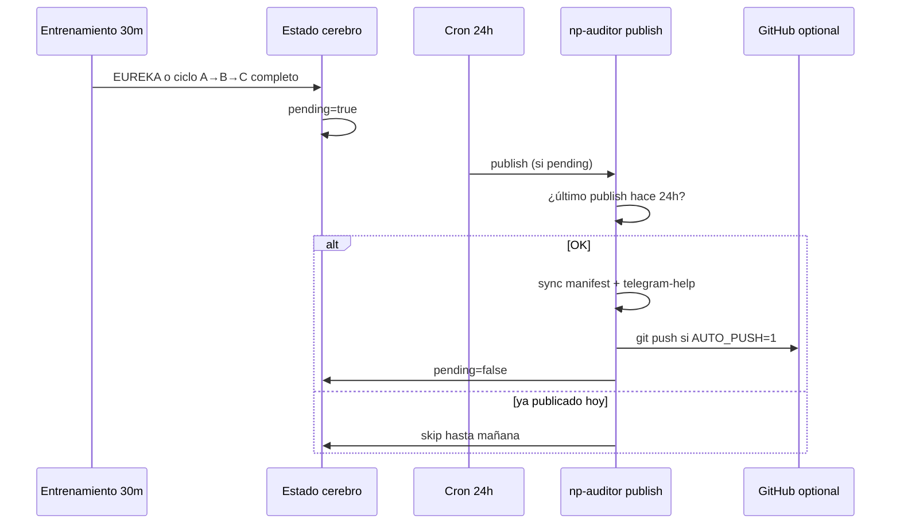

# Publicación diaria automática

Sí, **se puede**: el bot/repo público se actualiza **como máximo una vez al día**, solo si hubo trabajo en el ciclo.

---

## Cómo funciona



| Evento | Efecto |
|--------|--------|
| Dim nueva (EUREKA) | Marca `pending` |
| Ciclo rotación completo (vuelve a `agent-risk`) | Marca `pending` |
| Cron **24h** | Publica si `pending` y no publicó hoy |
| Segundo ciclo mismo día | Queda `pending` hasta el día siguiente |

---

## Qué se actualiza

| Archivo | Contenido |
|---------|-----------|
| `manifests/dims-subset.json` | Dims públicas desde banco |
| `manifests/release.json` | Versión, organismo, plataformas |
| `docs/telegram-help.txt` | Comandos Jarvis/Telegram |

Opcional: **git push** al repo `np-auditor`.

---

## Instalar cron (una vez)

```bash
cd ~/Projects/home-hub
./scripts/np-auditor-install-daily-publish.sh
```

Crea job OpenClaw `np-auditor-daily-publish` cada **24h**.

---

## Variables (`config/.env`)

```bash
# Activar push automático tras sync
NP_AUDITOR_AUTO_PUSH=1

# Repo dedicado (opcional): rsync + push ahí
NP_AUDITOR_PUBLISH_CLONE=~/Projects/np-auditor

NP_AUDITOR_GIT_REMOTE=origin
NP_AUDITOR_GIT_BRANCH=main
```

Sin `NP_AUDITOR_AUTO_PUSH=1` solo sincroniza archivos locales (sin git push).

---

## Comandos manuales

```bash
./scripts/np-auditor-publish.sh status    # pending / último publish
./scripts/np-auditor-publish.sh sync      # regenerar manifest ya
./scripts/np-auditor-publish.sh publish   # respeta límite 24h
./scripts/np-auditor-publish.sh publish --force   # ignorar 24h
./scripts/np-auditor-publish.sh pending --reason test
```

---

## Telegram

El cron puede anunciar resultado a tu chat (mismo `TELEGRAM_CHAT_ID` que otros crons).

El archivo `docs/telegram-help.txt` en el repo público refleja los comandos actuales del bot.
